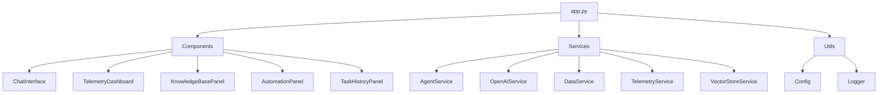

# Integrated Platform Environment (IPE) - System Architecture Documentation

## Table of Contents
1. System Overview
2. Core Components
3. Data Flow Architecture
4. Services Layer
5. Utilities
6. Configuration Management
7. Task Management
8. OpenAI Integration
9. Data Persistence
10. UI Components
11. Deployment Architecture
12. Error Handling
13. Performance Optimization

## 1. System Overview

### 1.1 Application Entry Point (app.py)
```python
# Main application flow in app.py
def main():
    # 1. Configuration Validation
    Config.validate()
    
    # 2. Session State Initialization
    initialize_session_state()
    
    # 3. Main UI Components
    current_page = render_sidebar()
    
    # 4. Page Routing
    if current_page == "Chat Interface":
        ChatInterface().render()
    elif current_page == "Telemetry Dashboard":
        TelemetryDashboard().render()
    elif current_page == "Knowledge Base":
        KnowledgeBasePanel().render()
    elif current_page == "Agent Tasks":
        AutomationPanel().render()
    elif current_page == "Task History":
        TaskHistoryPanel().render()
```

The application follows a modular architecture with these key components:
- UI Components (Streamlit-based)
- Services Layer (Business Logic)
- Data Layer (Task Management & Vector Store)
- Integration Layer (OpenAI & ChromaDB)

### 1.2 Component Dependencies


## 2. Core Components

### 2.1 ChatInterface Component
```python:src/components/chat_interface.py
class ChatInterface:
    def __init__(self):
        self.data_service = DataService()
        self.openai_service = OpenAIService()
        self.vector_store = VectorStoreService()
        self.logger = logging.getLogger(__name__)

    def render(self):
        # 1. Display chat history
        # 2. Show input form
        # 3. Handle message processing
        # 4. Update context
```

Key Features:
- Real-time chat interface
- Context-aware responses
- History tracking
- Knowledge base integration

### 2.2 TelemetryDashboard Component
```python:src/components/telemetry_dashboard.py
class TelemetryDashboard:
    def __init__(self):
        self.telemetry_service = TelemetryService()
        self.vector_store = VectorStoreService()
        self.logger = logging.getLogger(__name__)

    def render(self):
        # 1. Display metrics
        # 2. Show alerts
        # 3. Update visualizations
        # 4. Handle filtering
```

Features:
- Real-time metrics display
- Alert management
- Data visualization
- Historical analysis

### 2.3 KnowledgeBasePanel Component
```python:src/components/knowledge_base_panel.py
class KnowledgeBasePanel:
    def __init__(self):
        self.vector_store = VectorStoreService()
        self.data_service = DataService()
        self.logger = logging.getLogger(__name__)

    def render(self):
        # 1. Display articles
        # 2. Show categories
        # 3. Handle search
        # 4. Manage content
```

Features:
- Article management
- Category organization
- Search functionality
- Content updates

### 2.4 AutomationPanel Component
```python:src/components/automation_panel.py
class AutomationPanel:
    def __init__(self):
        self.agent_service = AgentService()
        self.logger = logging.getLogger(__name__)
        self.active_tasks = []

    def render(self):
        # 1. Display task creation form
        # 2. Show active tasks
        # 3. Handle task execution
        # 4. Manage task archiving
```

Key Features:
- Task creation interface
- Active task management
- Task execution control
- Real-time status updates

### 2.5 TaskHistoryPanel Component
```python:src/components/task_history_panel.py
class TaskHistoryPanel:
    def __init__(self):
        self.agent_service = AgentService()
        self.logger = logging.getLogger(__name__)

    def render(self):
        # 1. Load task history
        # 2. Display completed tasks
        # 3. Show execution details
        # 4. Enable history filtering
```

Features:
- Task history display
- Execution details view
- History filtering
- Result analysis

## 3. Data Flow Architecture

### 3.1 Chat Interface Flow
```python:src/services/data_service.py
class DataService:
    def process_chat_query(self, query: str) -> dict:
        # 1. Generate embeddings
        embeddings = self.openai_service.get_embeddings(query)
        
        # 2. Search vector store
        results = self.vector_store.search(
            embeddings,
            collections=["incidents", "kb_articles"]
        )
        
        # 3. Enrich context
        context = self._enrich_context(results)
        
        # 4. Get AI response
        response = self.openai_service.get_completion(
            query,
            context=context
        )
        
        return {
            "response": response,
            "context": context,
            "sources": results
        }
```

### 3.2 Telemetry Analysis Flow
```python:src/services/telemetry_service.py
class TelemetryService:
    def process_metrics(self, metrics: dict) -> dict:
        # 1. Store metrics
        self.vector_store.store_metrics(metrics)
        
        # 2. Analyze trends
        analysis = self._analyze_trends(metrics)
        
        # 3. Check alerts
        alerts = self._check_alerts(analysis)
        
        # 4. Update dashboard
        self._update_dashboard(analysis, alerts)
        
        return {
            "analysis": analysis,
            "alerts": alerts
        }
```

### 3.3 Task Management Flow
```python:src/services/agent_service.py
class AgentService:
    def create_task(self, description: str, context: dict) -> dict:
        # 1. Generate task ID
        task_id = f"task_{len(self.active_tasks) + len(self.task_history) + 1}"
        
        # 2. Create task object
        task = {
            "task_id": task_id,
            "description": description,
            "context": context,
            "status": "pending",
            "created_at": datetime.now().isoformat(),
            "steps": self._plan_task_steps(description, context)
        }
        
        # 3. Save task
        self.active_tasks.append(task)
        self._save_active_tasks()
        
        return task
```

## 4. Services Layer

### 4.1 DataService
```python:src/services/data_service.py
class DataService:
    def __init__(self):
        self.openai_service = OpenAIService()
        self.vector_store = VectorStoreService()
        self.logger = logging.getLogger(__name__)

    def _enrich_context(self, results: list) -> dict:
        context = {
            "incidents": [],
            "kb_articles": [],
            "telemetry": {}
        }
        
        for result in results:
            if result["collection"] == "incidents":
                context["incidents"].append(result["data"])
            elif result["collection"] == "kb_articles":
                context["kb_articles"].append(result["data"])
                
        return context
```

### 4.2 VectorStoreService
```python:src/services/vector_store_service.py
class VectorStoreService:
    def __init__(self):
        self.client = chromadb.Client()
        self.collections = {}
        self._initialize_collections()
        self.logger = logging.getLogger(__name__)

    def _initialize_collections(self):
        collections = ["incidents", "kb_articles", "telemetry", "chat_history"]
        for collection in collections:
            self.collections[collection] = self.client.get_or_create_collection(
                name=collection
            )
```

### 4.3 TelemetryService
```python:src/services/telemetry_service.py
class TelemetryService:
    def __init__(self):
        self.vector_store = VectorStoreService()
        self.openai_service = OpenAIService()
        self.logger = logging.getLogger(__name__)

    def _analyze_trends(self, metrics: dict) -> dict:
        # 1. Get historical data
        history = self.vector_store.get_metrics_history(
            metrics["system_id"],
            limit=100
        )
        
        # 2. Analyze patterns
        analysis = self.openai_service.analyze_metrics(
            current=metrics,
            history=history
        )
        
        return analysis
```

## 5. Data Loading and Initialization

### 5.1 Vector Store Initialization
```python:src/services/vector_store_service.py
def initialize_vector_store(self):
    # 1. Create collections
    self._initialize_collections()
    
    # 2. Load sample data
    self._load_sample_data()
    
    # 3. Verify integrity
    self._verify_collections()

def _load_sample_data(self):
    # Load incidents
    incidents = self._load_json("data/sample/incidents.json")
    self.collections["incidents"].add(
        documents=incidents,
        embeddings=self.openai_service.get_embeddings(incidents)
    )
    
    # Load KB articles
    articles = self._load_json("data/sample/kb_articles.json")
    self.collections["kb_articles"].add(
        documents=articles,
        embeddings=self.openai_service.get_embeddings(articles)
    )
```

### 5.2 Task Data Loading
```python:src/services/agent_service.py
def _load_task_data(self):
    # 1. Load active tasks
    try:
        with open("active_tasks.json", "r") as f:
            self.active_tasks = json.load(f)
    except FileNotFoundError:
        self.active_tasks = []
        
    # 2. Load task history
    try:
        with open("task_history.json", "r") as f:
            self.task_history = json.load(f)
    except FileNotFoundError:
        self.task_history = []
```

## 6. Sample Data Generation

### 6.1 Data Generator Service
```python:src/services/data_generator_service.py
class DataGeneratorService:
    def __init__(self):
        self.logger = logging.getLogger(__name__)
        self.sample_data_path = "data/sample"
        
    def generate_all_sample_data(self):
        """Generate all types of sample data"""
        self.generate_telemetry_data()
        self.generate_log_data()
        self.generate_incident_data()
        self.generate_jira_tickets()
        self.generate_health_checks()
```

### 6.2 Sample Data Sources

#### 6.2.1 Telemetry Data
```python:src/services/data_generator_service.py
def generate_telemetry_data(self):
    """Generate sample telemetry data using Kaggle dataset"""
    try:
        # Download from Kaggle
        kaggle.api.dataset_download_files(
            'dataset_id/telemetry-metrics',
            path=self.sample_data_path,
            unzip=True
        )
        
        # Process and format data
        df = pd.read_csv(f"{self.sample_data_path}/telemetry.csv")
        telemetry_data = df.to_dict('records')
        
        # Save processed data
        with open(f"{self.sample_data_path}/telemetry.json", 'w') as f:
            json.dump(telemetry_data, f, indent=2)
            
    except Exception as e:
        self.logger.error(f"Error generating telemetry data: {str(e)}")
        # Fallback to synthetic data
        self._generate_synthetic_telemetry()
```

#### 6.2.2 Log Data
```python:src/services/data_generator_service.py
def generate_log_data(self):
    """Generate sample log data using HuggingFace dataset"""
    try:
        # Load from HuggingFace
        dataset = load_dataset("log_dataset")
        log_data = dataset['train'].to_dict()
        
        # Process and format data
        processed_logs = self._process_log_data(log_data)
        
        # Save processed data
        with open(f"{self.sample_data_path}/logs.json", 'w') as f:
            json.dump(processed_logs, f, indent=2)
            
    except Exception as e:
        self.logger.error(f"Error generating log data: {str(e)}")
        # Fallback to synthetic data
        self._generate_synthetic_logs()
```

#### 6.2.3 Incident Data
```python:src/services/data_generator_service.py
def generate_incident_data(self):
    """Generate sample incident data"""
    incidents = []
    
    # Sample incident templates
    templates = [
        {
            "id": "INC-{id}",
            "title": "Service {service} experiencing {issue}",
            "description": "Detailed description of the incident",
            "status": "open",
            "priority": "high",
            "created_at": "timestamp",
            "updated_at": "timestamp",
            "assignee": "user",
            "tags": ["service", "issue_type"]
        }
    ]
    
    # Generate incidents
    for i in range(100):
        incident = self._generate_incident(templates, i)
        incidents.append(incident)
    
    # Save incidents
    with open(f"{self.sample_data_path}/incidents.json", 'w') as f:
        json.dump(incidents, f, indent=2)
```

#### 6.2.4 Jira Tickets
```python:src/services/data_generator_service.py
def generate_jira_tickets(self):
    """Generate sample Jira tickets"""
    tickets = []
    
    # Sample ticket templates
    templates = [
        {
            "key": "PROJ-{id}",
            "summary": "Task description",
            "description": "Detailed task description",
            "type": "task",
            "status": "open",
            "priority": "medium",
            "created": "timestamp",
            "updated": "timestamp",
            "assignee": "user",
            "labels": ["component", "priority"]
        }
    ]
    
    # Generate tickets
    for i in range(50):
        ticket = self._generate_ticket(templates, i)
        tickets.append(ticket)
    
    # Save tickets
    with open(f"{self.sample_data_path}/jira_tickets.json", 'w') as f:
        json.dump(tickets, f, indent=2)
```

#### 6.2.5 Health Checks
```python:src/services/data_generator_service.py
def generate_health_checks(self):
    """Generate sample health check data"""
    health_checks = []
    
    # Sample health check templates
    templates = [
        {
            "service": "service_name",
            "status": "healthy",
            "timestamp": "timestamp",
            "metrics": {
                "cpu_usage": "percentage",
                "memory_usage": "percentage",
                "response_time": "milliseconds",
                "error_rate": "percentage"
            },
            "checks": [
                {
                    "name": "check_name",
                    "status": "pass",
                    "details": "check details"
                }
            ]
        }
    ]
    
    # Generate health checks
    for i in range(200):
        health_check = self._generate_health_check(templates, i)
        health_checks.append(health_check)
    
    # Save health checks
    with open(f"{self.sample_data_path}/health_checks.json", 'w') as f:
        json.dump(health_checks, f, indent=2)
```

### 6.3 Synthetic Data Generation

#### 6.3.1 Telemetry Data Generator
```python:src/services/data_generator_service.py
def _generate_synthetic_telemetry(self):
    """Generate synthetic telemetry data"""
    telemetry_data = []
    services = ["web", "api", "database", "cache"]
    
    for _ in range(1000):
        timestamp = datetime.now() - timedelta(minutes=random.randint(0, 1440))
        service = random.choice(services)
        
        telemetry = {
            "timestamp": timestamp.isoformat(),
            "service": service,
            "metrics": {
                "cpu_usage": random.uniform(0, 100),
                "memory_usage": random.uniform(0, 100),
                "disk_usage": random.uniform(0, 100),
                "network_latency": random.uniform(0, 1000)
            }
        }
        telemetry_data.append(telemetry)
    
    return telemetry_data
```

#### 6.3.2 Log Data Generator
```python:src/services/data_generator_service.py
def _generate_synthetic_logs(self):
    """Generate synthetic log data"""
    log_data = []
    log_levels = ["INFO", "WARNING", "ERROR", "DEBUG"]
    services = ["web", "api", "database", "cache"]
    
    for _ in range(5000):
        timestamp = datetime.now() - timedelta(minutes=random.randint(0, 1440))
        level = random.choice(log_levels)
        service = random.choice(services)
        
        log = {
            "timestamp": timestamp.isoformat(),
            "level": level,
            "service": service,
            "message": f"Sample log message for {service}",
            "trace_id": str(uuid.uuid4())
        }
        log_data.append(log)
    
    return log_data
```

### 6.4 Data Loading and Validation

#### 6.4.1 Data Validation
```python:src/services/data_generator_service.py
def validate_sample_data(self):
    """Validate generated sample data"""
    validation_results = {
        "telemetry": self._validate_telemetry_data(),
        "logs": self._validate_log_data(),
        "incidents": self._validate_incident_data(),
        "jira_tickets": self._validate_jira_tickets(),
        "health_checks": self._validate_health_checks()
    }
    
    return validation_results
```

#### 6.4.2 Data Loading
```python:src/services/data_generator_service.py
def load_sample_data(self):
    """Load all sample data into vector store"""
    # Load telemetry data
    with open(f"{self.sample_data_path}/telemetry.json", 'r') as f:
        telemetry_data = json.load(f)
    self.vector_store.add_documents("telemetry", telemetry_data)
    
    # Load log data
    with open(f"{self.sample_data_path}/logs.json", 'r') as f:
        log_data = json.load(f)
    self.vector_store.add_documents("logs", log_data)
    
    # Load incident data
    with open(f"{self.sample_data_path}/incidents.json", 'r') as f:
        incident_data = json.load(f)
    self.vector_store.add_documents("incidents", incident_data)
    
    # Load Jira tickets
    with open(f"{self.sample_data_path}/jira_tickets.json", 'r') as f:
        ticket_data = json.load(f)
    self.vector_store.add_documents("jira_tickets", ticket_data)
    
    # Load health checks
    with open(f"{self.sample_data_path}/health_checks.json", 'r') as f:
        health_check_data = json.load(f)
    self.vector_store.add_documents("health_checks", health_check_data)
```

## 7. Error Handling

### 7.1 Service Layer
```python
try:
    # Operation
except Exception as e:
    self.logger.error(f"Error in operation: {str(e)}")
    raise
```

### 7.2 UI Layer
```python
try:
    # UI operation
except Exception as e:
    st.error(f"Error: {str(e)}")
```

## 8. Performance Optimization

### 8.1 Data Loading
- Lazy loading of task history
- In-memory caching of active tasks
- Efficient JSON file handling
- Vector store query optimization

### 8.2 UI Updates
- Real-time status updates
- Efficient task filtering
- Optimized rendering of task details
- Cached vector search results

### 8.3 Resource Management
- Connection pooling for vector store
- Rate limiting for OpenAI API
- Memory management for large datasets
- Efficient data serialization 

## 9. OpenAI Integration

### 9.1 Model Configuration
```python:src/services/openai_service.py
class OpenAIService:
    def __init__(self):
        self.api_key = os.getenv("OPENAI_API_KEY")
        self.model = os.getenv("OPENAI_MODEL", "gpt-3.5-turbo")
        self.embedding_model = os.getenv("OPENAI_EMBEDDING_MODEL", "text-embedding-ada-002")
        self.client = OpenAI(api_key=self.api_key)
        self.logger = logging.getLogger(__name__)
```

### 9.2 Model Usage Patterns

#### 9.2.1 Chat Completion
```python:src/services/openai_service.py
def get_completion(self, prompt: str, context: dict = None) -> str:
    messages = []
    
    # Add system message with context
    if context:
        system_message = f"""You are an AI assistant with the following context:
        Incidents: {json.dumps(context.get('incidents', []))}
        KB Articles: {json.dumps(context.get('kb_articles', []))}
        Telemetry: {json.dumps(context.get('telemetry', {}))}
        """
        messages.append({"role": "system", "content": system_message})
    
    # Add user message
    messages.append({"role": "user", "content": prompt})
    
    try:
        response = self.client.chat.completions.create(
            model=self.model,
            messages=messages,
            temperature=0.7,
            max_tokens=1000
        )
        return response.choices[0].message.content
    except Exception as e:
        self.logger.error(f"Error getting OpenAI completion: {str(e)}")
        raise
```

#### 9.2.2 Embedding Generation
```python:src/services/openai_service.py
def get_embeddings(self, text: Union[str, List[str]]) -> List[List[float]]:
    try:
        if isinstance(text, str):
            text = [text]
            
        response = self.client.embeddings.create(
            model=self.embedding_model,
            input=text
        )
        return [item.embedding for item in response.data]
    except Exception as e:
        self.logger.error(f"Error generating embeddings: {str(e)}")
        raise
```

#### 9.2.3 Task Planning
```python:src/services/agent_service.py
def _plan_task_steps(self, description: str, context: dict) -> list:
    prompt = f"""Plan the steps for the following task:
    Description: {description}
    Context: {json.dumps(context)}
    
    Return a JSON array of steps, where each step has:
    - id: unique identifier
    - description: what needs to be done
    - type: action or analysis
    - parameters: any required parameters
    - dependencies: list of step IDs this step depends on
    """
    
    response = self.openai_service.get_completion(prompt)
    return json.loads(response)
```

#### 9.2.4 Step Execution
```python:src/services/agent_service.py
def _execute_step(self, step: dict, context: dict) -> str:
    prompt = f"""Execute the following step:
    Step: {json.dumps(step)}
    Context: {json.dumps(context)}
    
    Return the result of executing this step.
    """
    
    return self.openai_service.get_completion(prompt)
```

#### 9.2.5 Telemetry Analysis
```python:src/services/telemetry_service.py
def analyze_metrics(self, current: dict, history: List[dict]) -> dict:
    prompt = f"""Analyze the following telemetry data:
    Current Metrics: {json.dumps(current)}
    Historical Data: {json.dumps(history)}
    
    Provide analysis including:
    1. Key trends
    2. Anomalies
    3. Potential issues
    4. Recommendations
    """
    
    response = self.openai_service.get_completion(prompt)
    return json.loads(response)
```

### 9.3 Model Integration Points

#### 9.3.1 Chat Interface
- Context-aware responses using system messages
- Dynamic context enrichment from vector store
- Conversation history management
- Response formatting and validation

#### 9.3.2 Task Automation
- Task planning and step generation
- Step execution and result analysis
- Error handling and recovery
- Progress tracking and reporting

#### 9.3.3 Knowledge Base
- Semantic search using embeddings
- Article relevance scoring
- Content summarization
- Category classification

#### 9.3.4 Telemetry Analysis
- Pattern recognition in metrics
- Anomaly detection
- Trend analysis
- Alert generation

### 9.4 Model Optimization

#### 9.4.1 Prompt Engineering
- Structured prompt templates
- Context injection
- Few-shot examples
- Chain-of-thought reasoning

#### 9.4.2 Response Processing
- JSON parsing and validation
- Error handling and retries
- Rate limiting
- Token management

#### 9.4.3 Performance Tuning
- Temperature control
- Max token limits
- Batch processing
- Caching strategies

### 9.5 Error Handling

#### 9.5.1 API Errors
```python:src/services/openai_service.py
def handle_api_error(self, error: Exception) -> None:
    if isinstance(error, openai.RateLimitError):
        self.logger.warning("Rate limit exceeded, implementing backoff")
        time.sleep(60)  # Wait 60 seconds
    elif isinstance(error, openai.APIError):
        self.logger.error(f"OpenAI API error: {str(error)}")
        raise
    else:
        self.logger.error(f"Unexpected error: {str(error)}")
        raise
```

#### 9.5.2 Response Validation
```python:src/services/openai_service.py
def validate_response(self, response: str, expected_format: str) -> bool:
    try:
        if expected_format == "json":
            json.loads(response)
        elif expected_format == "list":
            if not isinstance(response, list):
                return False
        return True
    except Exception as e:
        self.logger.error(f"Response validation failed: {str(e)}")
        return False
``` 