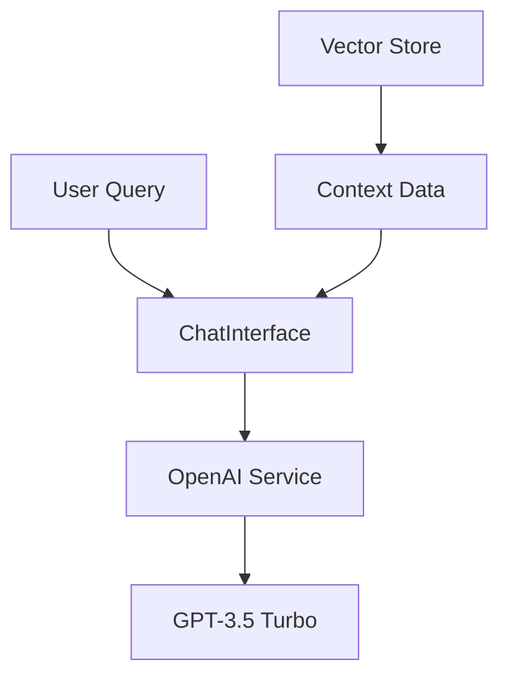

# IPE System Integration Documentation

## 1. Core Integration Points

### 1.1 OpenAI Integration


**Key Integration Points:**
1. **API Connection**
   - OpenAI API Key from `.env`
   - Model: GPT-3.5 Turbo
   - Endpoint: chat.completions

2. **Data Flow**
   - User query → Context enrichment → OpenAI → Response
   - Embeddings generation for vector search
   - Response processing and formatting

3. **Context Integration**
   - Incident data
   - KB articles
   - Telemetry metrics
   - Historical conversations

### 1.2 Vector Database (ChromaDB) Integration

**Connection Points:**
1. **Data Storage**
   - Location: `./data/vector_store`
   - Collections:
     * incidents
     * kb_articles
     * telemetry
     * chat_history

2. **Data Flow:**
```plaintext
Document → OpenAI Embedding → ChromaDB Storage → Similarity Search → Results
```

3. **Integration Methods:**
   - Direct document storage
   - Metadata association
   - Similarity search
   - Filter-based queries

### 1.3 Task Management Integration

**Connection Points:**
1. **Data Storage**
   - Location: `./ipe_agent/`
   - Files:
     * `active_tasks.json`
     * `task_history.json`

2. **Data Flow:**
```plaintext
Task Creation → Task Planning → Step Execution → Task Completion → History Storage
```

3. **Integration Methods:**
   - Task creation and planning
   - Step execution tracking
   - Task status management
   - History archiving

### 1.4 Sample Data Integration

**Data Sources:**
1. **Incident Data**
   - Format: JSON
   - Storage: ChromaDB
   - Fields:
     * ID
     * Title
     * Description
     * Status
     * Priority

2. **KB Articles**
   - Format: Markdown/JSON
   - Storage: ChromaDB
   - Fields:
     * ID
     * Title
     * Content
     * Category
     * Tags

3. **Telemetry Data**
   - Format: Time-series JSON
   - Storage: ChromaDB
   - Metrics:
     * CPU Usage
     * Memory Usage
     * Disk Usage
     * Network Latency

4. **Task Data**
   - Format: JSON
   - Storage: Local JSON files
   - Fields:
     * Task ID
     * Description
     * Context
     * Status
     * Steps

## 2. Data Flow Paths

### 2.1 Chat Interface Flow
```plaintext
1. User Input → ChatInterface
2. ChatInterface → DataService (Get Context)
   - Search relevant incidents
   - Search KB articles
   - Get telemetry data
3. ChatInterface → OpenAIService
   - Send enriched prompt
   - Get AI response
4. ChatInterface → Update UI
```

### 2.2 Vector Search Flow
```plaintext
1. Query → OpenAIService (Generate Embedding)
2. Embedding → ChromaDB (Search)
3. Results → DataService (Process)
4. Processed Results → Component
```

### 2.3 Telemetry Analysis Flow
```plaintext
1. Metrics → TelemetryService
2. TelemetryService → OpenAIService (Analysis)
3. Analysis → ChromaDB (Store)
4. Analysis → AlertsService (If needed)
```

### 2.4 Task Creation Flow
```plaintext
1. User Input → AutomationPanel
2. AutomationPanel → AgentService
   - Create task
   - Plan steps
   - Save task
3. AgentService → OpenAI
   - Generate step plan
   - Validate steps
4. AutomationPanel → Update UI
```

### 2.5 Task Execution Flow
```plaintext
1. User Trigger → AutomationPanel
2. AutomationPanel → AgentService
   - Load task
   - Execute steps
   - Update status
3. AgentService → OpenAI
   - Execute step
   - Analyze results
4. AutomationPanel → Update UI
```

### 2.6 Task History Flow
```plaintext
1. Task Completion → AgentService
2. AgentService → History Storage
   - Archive task
   - Update history
3. History → UI Display
   - Show completed tasks
   - Filter and search
```

## 3. Integration Configuration

### 3.1 Environment Variables
```plaintext
OPENAI_API_KEY=your-api-key
OPENAI_MODEL=gpt-3.5-turbo
VECTOR_DB_PATH=./data/vector_store
DEBUG=True
```

### 3.2 ChromaDB Configuration
```plaintext
Storage: Local Persistent
Collections: 
- incidents
- kb_articles
- telemetry
Index: HNSW
Distance: Cosine Similarity
```

### 3.3 Task Configuration
```plaintext
Storage: Local JSON Files
Files: 
- active_tasks.json
- task_history.json
Status Tracking: Real-time
History: Persistent
```

### 3.4 Data Schemas

**Incident Schema:**
```json
{
  "id": "string",
  "title": "string",
  "description": "string",
  "status": "string",
  "priority": "string",
  "created_at": "datetime",
  "metadata": {
    "type": "string",
    "system": "string"
  }
}
```

**KB Article Schema:**
```json
{
  "id": "string",
  "title": "string",
  "content": "string",
  "category": "string",
  "tags": ["string"],
  "metadata": {
    "last_updated": "datetime",
    "author": "string"
  }
}
```

**Telemetry Schema:**
```json
{
  "timestamp": "datetime",
  "system_id": "string",
  "metrics": {
    "cpu_usage": "float",
    "memory_usage": "float",
    "disk_usage": "float",
    "network_latency": "float"
  }
}
```

**Task Schema:**
```json
{
  "task_id": "string",
  "description": "string",
  "context": "object",
  "status": "string",
  "created_at": "datetime",
  "steps": [
    {
      "id": "string",
      "description": "string",
      "type": "string",
      "status": "string",
      "result": "string",
      "started_at": "datetime",
      "completed_at": "datetime"
    }
  ]
}
```

**History Schema:**
```json
{
  "task_id": "string",
  "description": "string",
  "status": "string",
  "created_at": "datetime",
  "completed_at": "datetime",
  "steps": [
    {
      "id": "string",
      "status": "string",
      "result": "string"
    }
  ]
}
```

## 4. Integration Points with External Systems

### 4.1 OpenAI Integration Details
- **Endpoint**: api.openai.com
- **Authentication**: API Key
- **Models Used**:
  * Chat: gpt-3.5-turbo
  * Embeddings: text-embedding-ada-002
- **Rate Limits**: Managed through service layer

### 4.2 ChromaDB Integration Details
- **Connection**: Local persistent storage
- **Data Persistence**: JSON/Parquet files
- **Index Updates**: Real-time
- **Query Types**:
  * Similarity search
  * Metadata filtering
  * Hybrid search

### 4.3 Task Management Details
- **Storage**: Local JSON files
- **Data Persistence**: File-based
- **Status Updates**: Real-time
- **Operations**:
  * Task creation
  * Step execution
  * Status tracking
  * History management

### 4.4 UI Integration Details
- **Framework**: Streamlit
- **Update Mechanism**: Real-time
- **Display Components**:
  * Task creation form
  * Active tasks list
  * Task execution view
  * History view

## 5. Error Handling and Retry Logic

### 5.1 OpenAI Service
```plaintext
1. Rate Limit Exceeded → Exponential backoff
2. API Error → Retry 3 times
3. Timeout → 30-second default
```

### 5.2 Vector Store
```plaintext
1. Connection Error → Retry with backoff
2. Query Error → Return empty results
3. Storage Error → Maintain backup
```

### 5.3 Task Management
```plaintext
1. File Error → Create new file
2. JSON Error → Backup and reset
3. Task Error → Mark as failed
```

### 5.4 UI Handling
```plaintext
1. Connection Error → Show retry option
2. Display Error → Clear and refresh
3. Input Error → Show validation message
```

## 6. Performance Considerations

### 6.1 Caching Strategy
- OpenAI responses: 1 hour
- Vector search results: 15 minutes
- Telemetry data: 5 minutes
- Task data: In-memory during session
- History data: File-based

### 6.2 Batch Processing
- Embedding generation: 100 items
- Vector store updates: 1000 items
- Telemetry processing: 500 records
- Task creation: Single task
- Step execution: Sequential
- History updates: Single task

### 6.3 Query Optimization
- Use metadata filters
- Limit search results
- Implement pagination
- Lazy loading of history
- Real-time status updates
- Efficient task filtering
